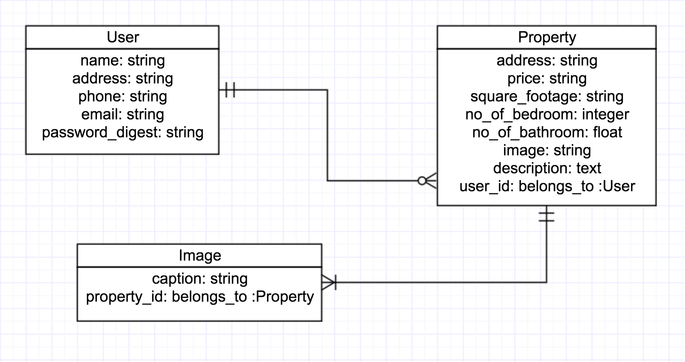

# README

## LocalHomes4Sale

LocalHomes4Sale is a web application for users to checkout local properties that are available for sale. This web application allows a user to create an account and post one or more properties for sale. It also provides complete description of the property that a user selects. 

Check out the web application here: [LocalHomes4Sale]()

### Technologies used:

- Ruby v. 2.4.1p111
- Rails v. 5.1.4
- Postgresql - Database
- Git
- Heroku
- Bootstrap 4.0
- HTML/CSS/Javascript/Jquery

### Approach taken: 

								***ERD***

							***Wireframes***
	

### Installation/Startup instructions:

- `Sign up` to create your user account and once you are logged in, you can go ahead and post your property with all the details up for sale.
- If you are using this web application to checkout properties for sale, you can do that once you sign up and are logged in using your email and password.
- You can always update your account details by clicking on the `Edit account` and then saving the changes by clicking on `Save changes`.
- If you ever want to delete your account you can do that by clicking `Delete account` and confirming with `yes` when requested.
- To post your a property up for sale, click on `Create a new post` and fill out all the required details. Don't forget to `Save` the post to make it visible in the list of properties available for sale.
- You can also edit posting for your property by selecting `Edit Post` for the one you want to make changes to. Again, make sure to `Save` the changes to update the details for your posting. 

### Check out user stories here: [Trello Board](https://trello.com/b/DFoPt5OU/localhomes4sale-user-stories)

### Unsolved problems & next steps:

